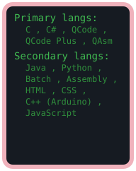

```c
#define STATUS "CODING"
int main() {
	char* projects[] = {
		"Qunetra - Lightweight 32-bit x86 kernel written in C and Assembly, booted via GRUB (Multiboot2) with LFB graphics support",
		"QGPU - Lightweight 2D Graphics Wrapper in C built on Vulkan & GLFW",
		"QEngine - 2D game engine written in C",
		"QCode - Programming Language & Interpreter in C",
		"QAsm - Programming Language & Compiler in C targeting x86_64 Assembly",
		"QCode Plus - Programming Language & Compiler in C targeting QAsm",
	};
	return 0;
}
```
