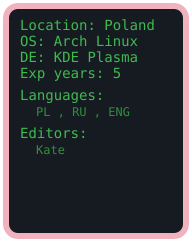

```c
#define STATUS "CODING"
int main() {
	char* primary_languages[] = {"C", "C#", "QCode", "QCode+", "QAsm"};
	char* secondary_languages[] = {
		"Java", "Python", "Batch", "Assembly",
		"HTML", "CSS", "C++ (Arduino)", "JavaScript"
	};
	char* projects[] = {
		"QuneOS - Custom x86/x86_64 OS: Bootloader & Kernel from scratch",
		"QGPU - Lightweight 2D Graphics Wrapper in C built on Vulkan & GLFW",
		"QEngine - 2D game engine written in C",
		"QCode - Programming Language & Interpreter in C",
		"QAsm - Programming Language & Compiler in C targeting x86_64 Assembly",
		"QCode Plus - Programming Language & Compiler in C targeting QAsm",
	};
	return 0;
}
```
